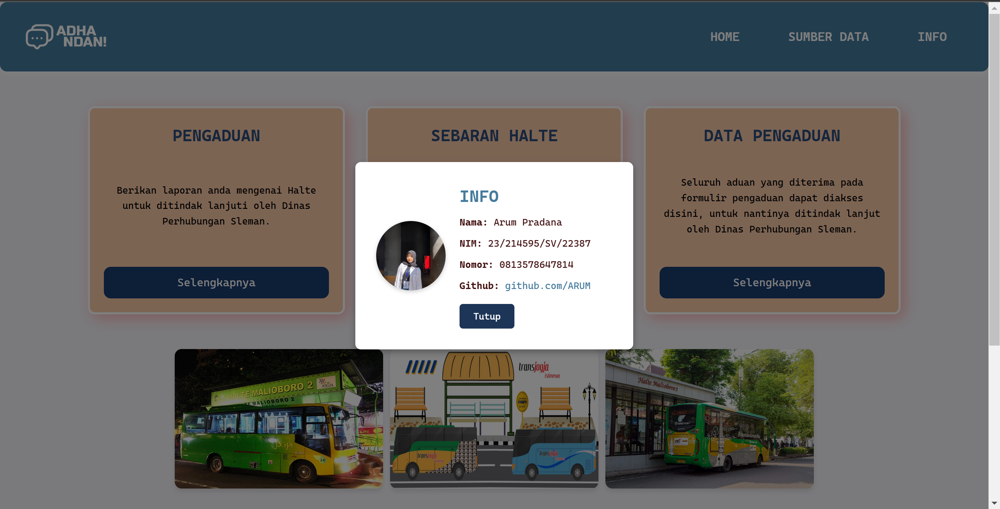

# WEBGIS Persebaran Halte Kewenangan Dinas Perhubungan Kabupaten Sleman Daerah Istimewa Yogyakarta

Website ini dibuat untuk Platfom ini terinspiransi dari laman pengaduan dari DISHUB DIY mengenai fasilitas diseluruh DIY. WebGIS ini dibuat untuk memberikan laman pengaduan mengenai fasilitas halte di area Sleman yang wewenangnya dipegang oleh DISHUB Sleman. Selain itu platfom ini juga memberikan data persebaran Halte di Sleman. 

## Tujuan Pembuatan Website
Website dibuat untuk memberikan informasi persebaran halte di area Sleman, dari fasilitas halte tersebut apabila pengguna memiliki aduan dapat disampaikan pada laman pengaduan untuk ditindak lanjuti. Data halte ini merupakan halte dengan wewenang DISHUB Sleman, yang harapannya aduan dapat ditindak lanjuti oleh pihak yang berwewenang.

## Komponen Pembangun
Website ini dibuat dengan data halte Sleman dengan wewenang Dinas Perhubungan Sleman yang didapatkan dari laman **geoportal** Sleman. Data tersebut dikembangkan dengan berbagai komponen dan fitur untuk kumpulan data dari database **phpmyAdmin**,  visualisasi data dengan menggunakan **GeoJSON**. Serta penggunaan library **JavaScript** untuk menggunakan fitur aksi.  
Implementasi style untuk memberikan interaktif dan variasi webGIS didapatkan dari fungsionalitas **leaflet** dan **bootstrap**.

## Sumber Data
Dinas Perhubungan DIY [https://dishub.jogjaprov.go.id/trans-jogja](https://dishub.jogjaprov.go.id/trans-jogja)

Geoportal Sleman [https://geoportal.slemankab.go.id/#/](https://geoportal.slemankab.go.id/#/)

Dinas Perhubungan Sleman [https://perhubungan.slemankab.go.id/](https://perhubungan.slemankab.go.id/)

## Preview webGIS

